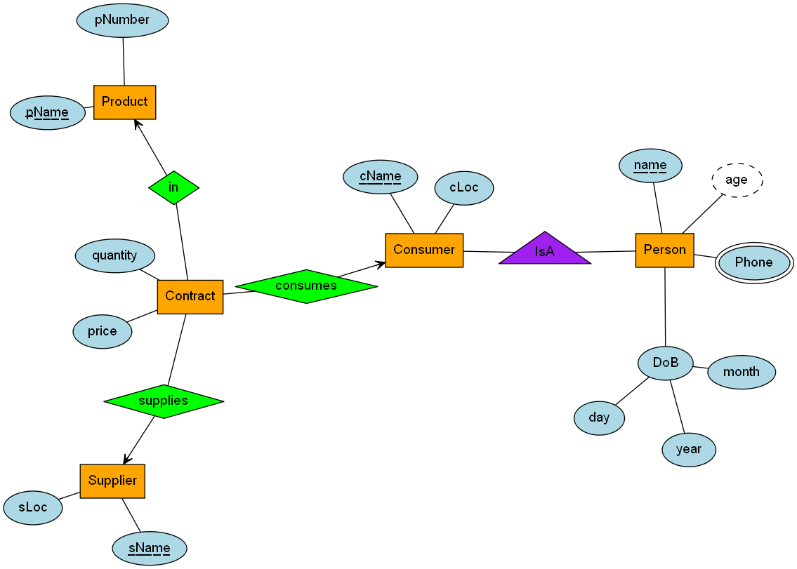

# Create ER Diagrams with Python Objects
## Developed by Cutter Beck

## Getting Started
- Make sure to install Graphviz locally from [https://graphviz.org/download/](https://graphviz.org/download/)
- Install the Graphviz Python package with `pip install graphviz`
- Open `example.ipynb` and click Run All to generate an example ER diagram like the one below

## Making Your Own ER Diagram
- Create a new Python file or .ipynb Notebook in the `src` directory
- Import the graphing package with `from PyErGraphing.PyErGraphing import *`
- Define your Entities, Attributes, Relationships, and ER Diagram objects as shown in the example file
- Draw your diagram with the `draw()` method of your ER Diagram object!
    - This will generate a .png file in whatever directory you run the script from and display it if you are in a Notebook